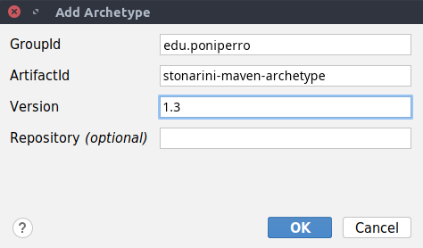

# stonarini-archetype
Template/Tutorial to create a custom archetype for Maven. 
Features: 
 - [X] Configure directory structure
 - [X] JaCoCo and JUnit  
 - [X] jar manifest
 - [X] Dockerfile
 - [X] Auto-Incrementing Version

## Quick install
For those who want to use the archetype as-is, just clone the repo and execute mvn install:
```
git clone https://www.github.com/stonarini/stonarini-maven-archetype
cd stonarini-maven-archetype
mvn install
```
Then when you create a new maven proyect in your favorite IDE you'll be able to select the archetype. 
If you use IntelliJ though, you'll need to add it manually; First create a new proyect, and when you need to 
select a Maven archetype, search for a button that says *Add New...*, and introduce the following (changing the current version):


## Features
Before going into how to create your custom archetype, I will explain the features my archetype has, to give you some inspiration.

First I've added the basic maven plugins; Then I've also "locked" the Java version to JRE-11.  
Then I've added the JUnit dependency for testing and the JaCoCo plugin to check code coverage.  
After that I've added a *.gitignore*.  

Then I've played a little bit with Docker, and I decided to add an autogenerated, ready-to-go Dockerfile, just build and run.  
Last but not least I've added a little script to update the version in both the pom and the Dockefile for those lazy people out there ;)  

## The Basics
The first thing to know it's the basic structure and files we will need.  
From the [official documentation](https://maven.apache.org/guides/mini/guide-creating-archetypes.html):
```
archetype/
|-- pom.xml
`-- src/
    `-- main/
        `-- resources/
            |-- META-INF/
            |   `-- maven/
            |       `--archetype-metadata.xml
            `-- archetype-resources/
                |-- pom.xml
                `-- src/
                    |-- main/
                    |   `-- java/
                    |       `-- App.java
                    `-- test/
                        `-- java/
                            `-- AppTest.java
```
Let's brake it down:  

## archetype pom.xml
We start with the root directory *archetype*; In here we have to create a basic maven structure with a *pom.xml* and a *src/* directory with a *main/* subdirectory.  
Now, instead of having a *java/* directory like a normal proyect, we have to create a directory called *resources/*.  
Our directory structure should look like this:
```
archetype/
|-- pom.xml
`-- src/main/resources/
```
In the *pom.xml* we just need to specify basic information. You can copy [my example](pom.xml) or the one from the [documentation](https://maven.apache.org/guides/mini/guide-creating-archetypes.html). Remember to change the project's *groupId* and *artifactId* to match your own.

## archetype-metadata.xml
Now in this *resources/* directory we need to create two more directories, *META-INF* and *maven* so our directory structure should look like this:
```
archetype/
|-- pom.xml
`-- src/main/resources/META-INF/maven/archetype-metadata.xml
```
We should also create a xml file called *archetype-metadata.xml*.This file contains the information about what directory structure we want the archetype to automatically create.  
```xml
<archetype-descriptor xmlns="https://maven.apache.org/plugins/maven-archetype-plugin/archetype-descriptor/1.1.0" 
					  xmlns:xsi="http://www.w3.org/2001/XMLSchema-instance" 
					  xsi:schemaLocation="https://maven.apache.org/plugins/maven-archetype-plugin/archetype-descriptor/1.1.0 https://maven.apache.org/xsd/archetype-descriptor-1.1.0.xsd" 
					  name="stonarini-archetype">
    <fileSets>
        <fileSet filtered="true" packaged="true">
            <directory>src/main/java</directory>
            <includes>
                <include>**/*.java</include>
            </includes>
        </fileSet>
        <fileSet filtered="true" packaged="true">
            <directory>src/test/java</directory>
            <includes>
                <include>**/*.java</include>
            </includes>
        </fileSet>
    </fileSets>
</archetype-descriptor>
<!-- archetype-metadata.xml -->
```
In this file we need to change the *name* attribute so that is the same as the *attributeId* in our *pom.xml*. Then, in the *fileSets* tag we need to specify the "raw" directory structure. In my case, I specified a simple maven structure with main and test.  

The ```packaged``` attribute is needed if you want the directories of your *groupId* to be created:
```yaml
groupId: edu.poniperro
```
```toml
packaged="false"
# src/
# |-- main/java/
# `-- test/java/
```
```toml
packaged="true"
# src/
# |-- main/java/edu/poniperro
# `-- test/java/edu/poniperro
```
While the ```filtered``` attribute is needed if you want to access the project's parameters inside a file, pay attention to the *${package}*:
```java
// filtered="false" (default)
package ${package};

public class App {
    public static void main(String[] args) {
        System.out.println("filtered=false");
    }
}
```
```java
// filtered="true"
package edu.poniperro;

public class App {
    public static void main(String[] args) {
        System.out.println("filtered=true");
    }
}
```
Last but not least, the *includes* tag. In this tag we can specify specific files we want to copy every time we use the archetype. I used a generic syntax to copy every java file present.
```xml
<include>**/*.java</include>
```
## archetype-resources
Now we need to head back to the *resources* directory.  
Here we are going to create a directory named *archetype-resources*. In this directory we will create a template for the archetype that should follow the structure declared in the *archetype-metadata.xml*, so in my case:
```            
archetype-resources/
|-- pom.xml
`-- src/
	|-- main/
	|   `-- java/
	|       `-- App.java
	`-- test/
            `-- java/
                `-- AppTest.java
```
Now this template is special because we can access parameters such as the groupId, attributeId, package, etc... that we will provide to the archetype when we will use it.  
To access this properties use a dollar and curly braces:
```sh
${attributeId}
```
If filtered is set to true this parameters are accessible to all files (java, xml, etc). If filtered is false only the *pom.xml* will have access to this properties.
## Template pom.xml
Now, addressing the [elephant in the room](https://raw.githubusercontent.com/devicons/devicon/2ae2a900d2f041da66e950e4d48052658d850630/icons/gradle/gradle-plain.svg), you will need to customise this pom.xml as you like.  
[My example](src/main/resources/archetype-resources/pom.xml) has the very much needed JUnit dependency and the core maven plugins. The only added plugin is the JaCoCo one.  
I also added some custom configuration for the jar manifest.  

So, summing up, beside using the "dollar" parameters, configure this file as you see fit for your project.

A very basic example could look like this:
```xml
<project xmlns="http://maven.apache.org/POM/4.0.0" 
		 xmlns:xsi="http://www.w3.org/2001/XMLSchema-instance"
		 xsi:schemaLocation="http://maven.apache.org/POM/4.0.0 https://maven.apache.org/xsd/maven-4.0.0.xsd">
    <modelVersion>4.0.0</modelVersion>

    <groupId>${groupId}</groupId>
    <artifactId>${artifactId}</artifactId>
    <version>${version}</version>

    <name>${artifactId}</name>
</project>
```

## Building/Packaging the archetype
This is definetly the easiest part of the process. 
To create a *.jar* out of your archetype and automatically install it, just open a terminal in the root directory (where our original *pom.xml* is) and run the command:
```sh
mvn install
```

## Create a project using the new Archetype
Now I will illustrate how to create a new project using directly maven. Afaik *VSCode* should automatically aknowledge the new archetype.

To create a new project with the archetype use the following command:
```sh
mvn archetype:generate                                    \
	-DarchetypeGroupId=<archetype-groupId>                \
	-DarchetypeArtifactId=<archetype-artifactId>          \
	-DarchetypeVersion=<archetype-version>                \
	-DgroupId=<my.groupid>                                \
	-DartifactId=<my-artifactId>
```
Where **\<archetype-groupId>**, **\<archetype-artifactId>** and **\<archetype-version>** are the parameters specified in the *archetype pom.xml*.  
While **\<my.groupid>** is the package name (ie: edu.poniperro), and **\<my-artifactId>** is the project name.
